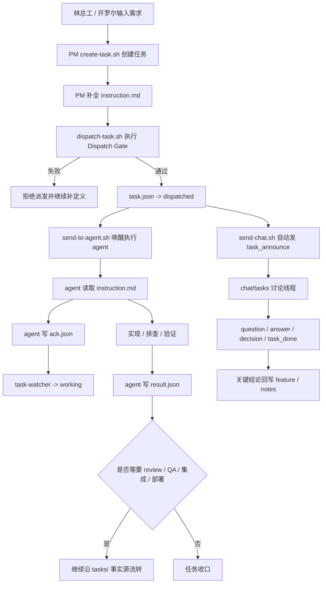

# my-agent-teams

> 基于 OpenClaw + tmux 的多智能体协作框架
> 通过文件系统做状态管理，tmux 做消息通道，watcher 做状态监控，实现 AI agent 之间的任务派发、执行、审查和集成。

## 5 分钟开始

先准备这些依赖：

- `git`
- `python3`（建议 3.10+）
- `tmux`
- `codex` 或 `claude` CLI（至少装一个，并且命令行里可直接运行）

最短启动流程：

```bash
git clone <repo-url>
cd my-agent-teams

# 默认创建小团队
scripts/teamctl.sh init
scripts/teamctl.sh doctor
scripts/teamctl.sh up
scripts/teamctl.sh status
```

如需更高并发，初始化时选择团队规模：

```bash
scripts/teamctl.sh init --team medium
scripts/teamctl.sh init --team large
```

团队规模：

| 规模 | 人数 | 配置 | 适合场景 |
| --- | ---: | --- | --- |
| `small`（默认） | 4 | PM 1 + 架构/集成 1 + 开发 1 + QA 1 | 小功能、修复、轻量并行 |
| `medium` | 7 | PM 1 + 架构/集成 1 + 开发 3 + QA 1 + Review 1 | 常规多任务并行 |
| `large` | 13 | PM 1 + 架构/集成 2 + 开发 6 + QA 2 + Review 2 | 多模块、高并发交付 |

说明：

- `init` 会自动创建 `.venv`、安装看板依赖，并执行 `bootstrap --render-config`。
- `config.local.json` 会自动生成；飞书配置可以后补，不影响本地先跑通。
- `up` 会依次启动 `agents`、`watcher`、`dashboard`。
- 看板默认地址是 [http://127.0.0.1:5001/](http://127.0.0.1:5001/)。
- 查看和进入 agent 的 tmux 会话：
  ```bash
  scripts/teamctl.sh sessions
  scripts/teamctl.sh attach pm-chief
  scripts/teamctl.sh attach dev-1
  ```

如果你准备让 Codex 走本仓库自带的 Responses Gateway，先在 `up` 之前额外执行：

```bash
scripts/teamctl.sh init-codex-gateway-config
export OPENAI_API_KEY='sk-...'
export CODEX_GATEWAY_API_KEY='local-random-token'
scripts/teamctl.sh start-codex-gateway
scripts/teamctl.sh install-codex-profile
export CODEX_CMD='codex -p dev-team'
```

## 这是什么

一个让多个 AI agent（Claude Code / Codex）协同完成开发任务的框架。

不依赖 WebSocket、HTTP API 或消息队列——只用 **tmux session + 文件系统 + shell 脚本** 就能让 agent 之间可靠协作。

### 核心理念

```
Agent 之间不直接对话。
所有通信通过文件中介和 tmux send-keys。
状态变更通过 watcher 脚本自动检测和通知。
```

### 团队拓扑

`scripts/teamctl.sh init` 默认生成 `small` 团队；`--team medium` / `--team large` 会在初始化时重写 `config.json` 中的 agent 拓扑、默认 reviewer/tester 和 tmux session 列表。后续用 `scripts/teamctl.sh sessions` 查看会话，用 `scripts/teamctl.sh attach <agent-id>` 进入对应 tmux session。

### 工作目录隔离（当前方案）

- 每个 agent 都从独立工作目录启动：`agents/<agent-id>/`
- Claude Code 读取当前工作目录下的 `CLAUDE.md`
- Codex agent 目录读取当前工作目录下的 `AGENT.md`
- 根目录 `CLAUDE.md` / `AGENTS.md` 只保留**通用规则**
- `instruction.md` 回归纯任务描述：只写做什么、改哪些文件、验收标准，不再注入角色身份
- `tasks/`、`scripts/`、`config.json`、`design/agent-templates/` 等共享资源统一通过**绝对路径**访问
- 新任务 ID 必须使用中文标题式名称，例如：`修复Word生成质量问题`、`Agent目录隔离方案`
- `T-001` 这类旧编号和纯英文 slug 不允许用于新建任务


## 顶层控制脚本

推荐优先使用顶层控制脚本 `scripts/teamctl.sh`，避免手工改路径。

```bash
cd /path/to/my-agent-teams

# 1) 首次初始化：创建 .venv、安装依赖、渲染本机路径、生成 agent 文件
scripts/teamctl.sh init
# 可选：scripts/teamctl.sh init --team medium
# 可选：scripts/teamctl.sh init --team large

# 2) 检查依赖、路径、agent 文件、tmux session、项目根目录
scripts/teamctl.sh doctor

# 3) 可选：启用 Codex Responses Gateway（用于统一接 Codex 自定义 provider）
scripts/teamctl.sh init-codex-gateway-config
# 编辑 config/codex-responses-gateway.json，确认上游与模型映射；设置 OPENAI_API_KEY / CODEX_GATEWAY_API_KEY
scripts/teamctl.sh start-codex-gateway
scripts/teamctl.sh install-codex-profile
export CODEX_CMD='codex -p dev-team'

# 4) 启动 agents、watcher、dashboard
scripts/teamctl.sh up

# 5) 查看状态
scripts/teamctl.sh status

# 6) 查看或进入 agent tmux session
scripts/teamctl.sh sessions
scripts/teamctl.sh attach pm-chief

# 7) 同步人力数据到飞书甘特图（先 dry-run，再真实写入）
scripts/sync-gantt-to-feishu.sh --dry-run
scripts/sync-gantt-to-feishu.sh
```

说明：
- `init` 内部会执行 `bootstrap --render-config`，按当前 checkout 路径重写 `config.json` 中的本机路径。
- 飞书密钥仍放在被 git 忽略的 `config.local.json`。
- Codex Gateway 本机配置默认写入被 git 忽略的 `config/codex-responses-gateway.json`；示例见 `config/codex-responses-gateway.example.json`。
- 如开罗尔项目不在默认相邻目录，可在 bootstrap 前设置：
  ```bash
  export CHIRALIUM_DEV_ROOT=/path/to/chiralium
  export CHIRALIUM_PROD_ROOT=/path/to/prod/chiralium
  ```
- `CODEX_CMD` / `CLAUDE_CMD` 可覆盖 agent 启动命令。

## 将控制面更新应用到一线团队

当仓库里的协作控制面（`scripts/`、`dashboard/`、`design/agent-templates/`、`README.md`）有新能力上线时，推荐按下面步骤把改动切到正在干活的一线团队。

### 1. 只同步代码，不覆盖运行产物

优先使用 `git pull`、`git cherry-pick` 或发布分支同步代码。  
不要把下面这些目录/文件当成“代码包”直接覆盖到一线机器：

- `tasks/`：真实任务事实源
- `agents/`：各 agent 当前工作目录与本地上下文
- `.runtime/`：watcher / dashboard / queue 运行时状态
- `config.local.json`：本机密钥和通知配置

一句话：**把脚本和模板带过去，不要把现场任务状态冲掉。**

### 2. 切换前先做健康检查

```bash
cd /path/to/my-agent-teams
scripts/teamctl.sh doctor
scripts/teamctl.sh smoke
```

如果只是快速切换，至少跑 `doctor`；涉及 watcher / control-plane 改动时，建议把 `smoke` 也过一遍。

### 3. 重启控制面，让新逻辑真正生效

控制面脚本更新后，**watcher 必须重启**；否则当前在跑的进程不会自动热加载新逻辑。

```bash
cd /path/to/my-agent-teams
scripts/teamctl.sh restart-services
scripts/teamctl.sh status
```

`restart-services` 只会重启**当前正在运行**的 watcher / dashboard / codex-gateway，**不会触碰任何 agent tmux session**。如果某个服务当前没跑，默认跳过；如需顺手拉起未运行服务，可改用单独的 `start-*` 命令，或显式加 `--force`。

如果同一批更新还改了 dashboard / 甘特图 / API 查询，再额外重启看板：

```bash
cd /path/to/my-agent-teams
scripts/teamctl.sh stop-dashboard
scripts/teamctl.sh start-dashboard
```

通常 **不用** 因为控制面更新而重启所有 agent session；只有下面几种情况才需要考虑重启 agent：

- agent 角色模板（`agents/<agent-id>/AGENT.md` / `CLAUDE.md`）刚被重生成并要求重新加载
- 运行时命令变了（例如 `CODEX_CMD` / `CLAUDE_CMD` 调整）
- tmux session 本身已经不健康，正好借切换窗口一起恢复

如确实需要重启全部 agent，会话重启已被单独收口为危险命令，且**必须人工确认**：

```bash
cd /path/to/my-agent-teams
scripts/teamctl.sh restart-agents
```

执行时会列出受影响的 tmux session，并要求在交互式终端手工输入确认短语。

### 4. 一线 PM 切换后的新操作约定

#### 4.1 pull 任务优先走任务池

- `claim_policy=pull` 的任务优先进入 pool
- 不要把它们当普通 push 任务手工直派
- 只有明确 override 时，才使用 `FORCE_DIRECT_DISPATCH=1`

#### 4.2 `resume` 和 `reassign` 分开用

原执行者继续做，用 `resume-task.sh`：

```bash
scripts/resume-task.sh --task-dir /absolute/path/to/tasks/<task-id> --agent <same-agent> --reason "继续当前任务"
```

换人接手，用 `reassign-task.sh`：

```bash
scripts/reassign-task.sh --task-dir /absolute/path/to/tasks/<task-id> --agent <new-agent> --reason "会话异常，转派接手"
```

语义上不要再长期拿 `resume` 代替“换人接手”。

#### 4.3 开始巡检 PM Inbox 的控制面异常

```bash
cd /path/to/my-agent-teams
python3 scripts/task-inbox.py --tasks-root ./tasks --control-config ./config.json
```

当前应重点关注这些原因：

- `delivery_failed`
- `session_unhealthy`
- `auto_requeue`
- `reassigned`
- `state_invariant_violation`

它们表示的是**调度/连接层恢复问题**，不等于业务执行失败。

### 5. 上线后最小验证清单

建议至少拿 3 类任务做一次小流量验证：

1. 一个普通 `development` 池任务
2. 一个 `verification` 任务
3. 一个故意制造 session 不健康的任务，确认 watcher 会重试、转派或回池

上线后重点看：

- watcher 日志里是否出现新的控制面恢复记录
- PM Inbox 是否能看到控制面异常，而不只是 timeout
- `pull` 任务是否还在被绕过任务池手工直派
- `resume` / `reassign` 是否已经被一线按语义分开使用

如果切换后行为异常，优先检查：

- watcher 是否已经重启
- 一线机器上的 `config.json` 是否还是旧路径/旧 agent 配置
- 任务目录里是否残留旧轮次 `ack.json` / `result.json`


## Codex Responses Gateway / One API 落地闭环

`design/one-api-plan.md` 的结论是：Codex 不应直接把标准 `base_url=https://one-api.example.com/v1` 指到经典 One API，因为标准 relay 缺少 `/v1/responses`。本仓库落地的是独立 **Codex Responses Gateway**：

```text
Codex agent -> ~/.codex profile (wire_api=responses) -> local gateway -> Responses-compatible upstream
```

最小本机流程：

```bash
cd /path/to/my-agent-teams

# 1) 生成本机网关配置（不会提交真实密钥）
scripts/teamctl.sh init-codex-gateway-config

# 2) 配置密钥
export OPENAI_API_KEY='sk-...'
export CODEX_GATEWAY_API_KEY='local-random-token'

# 3) 启动网关并安装 Codex profile
scripts/teamctl.sh start-codex-gateway
scripts/teamctl.sh install-codex-profile

# 4) 用网关 profile 启动 Codex agent
export CODEX_CMD='codex -p dev-team'
scripts/teamctl.sh start-agents
```

关键文件：

- `scripts/codex-responses-gateway.py`：仅处理 `POST /v1/responses`，streaming 原样透传；只在响应尚未开始前做故障切换。
- `scripts/install-codex-gateway-profile.py`：向 `~/.codex/config.toml` 写入托管 profile，并设置 `requires_openai_auth = false`。
- `config/codex-responses-gateway.example.json`：网关配置示例；复制出的 `config/codex-responses-gateway.json` 被 `.gitignore` 忽略。
- `config/codex-profile.example.toml`：Codex profile 示例。

One API 经典版仍可在后续作为 POC 目标验证 `/v1/oneapi/proxy/:channelid/*target` 是否能透明代理 Responses，但在路径、鉴权、streaming、计费和模型映射全部验证前，不进入默认生产链路。

## 快速开始

### 前置条件

- macOS / Linux
- tmux
- jq
- Python 3
- 至少 2 个 tmux session 运行 Claude Code 或 Codex（一个当 PM，一个当执行 agent）

### 1. 启动 agent（进入独立工作目录）

```bash
# PM（Claude Code）
cd /Users/linsuchang/Desktop/work/my-agent-teams/agents/pm-chief

# 架构师（Codex）
cd /Users/linsuchang/Desktop/work/my-agent-teams/agents/arch-1

# 全栈开发（Codex）
cd /Users/linsuchang/Desktop/work/my-agent-teams/agents/dev-1
cd /Users/linsuchang/Desktop/work/my-agent-teams/agents/dev-2

# QA（Claude Code）
cd /Users/linsuchang/Desktop/work/my-agent-teams/agents/qa-1

# Reviewer（Codex）
cd /Users/linsuchang/Desktop/work/my-agent-teams/agents/review-1
```

各 agent 启动后先读取各自目录下与运行时匹配的角色文件再按其中规则工作：
- Claude Code 自动读取：`CLAUDE.md`
- Codex 自动读取：`AGENT.md`
- 每个 agent 目录都同时保留 `AGENT.md` 和 `CLAUDE.md`，林总工可按规划切换运行时。

> ⚠️ agent 角色文件由模板自动生成，请勿手动编辑。见下方「角色模板系统」。

### 2. 启动 watcher

```bash
# 前台运行（调试用）
SCAN_INTERVAL=3 /Users/linsuchang/Desktop/work/my-agent-teams/scripts/task-watcher.sh

# 后台运行（生产用）
SCAN_INTERVAL=3 /Users/linsuchang/Desktop/work/my-agent-teams/scripts/task-watcher.sh >> /tmp/agent-teams-watcher.log 2>&1 &
```

### 3. 创建任务

```bash
/Users/linsuchang/Desktop/work/my-agent-teams/scripts/create-task.sh 实现用户登录页 "实现用户登录页" dev-1 development chiralium "frontend/src/pages/Login.tsx" false false reviewer dev dev
```

这会创建 `tasks/实现用户登录页/` 目录，包含：
- `task.json` — 任务定义（状态=pending）
- `instruction.md` — 纯任务指令模板（需 PM 填充任务目标、write_scope、验收标准等）
- `transitions.jsonl` — 状态变更日志

### 4. 派发任务

```bash
/Users/linsuchang/Desktop/work/my-agent-teams/scripts/dispatch-task.sh /Users/linsuchang/Desktop/work/my-agent-teams/tasks/实现用户登录页/task.json
```

- 将 `task.json.status` 改为 `dispatched`
- 通过 `tmux send-keys` 将 instruction.md 内容发送给目标 agent 的 tmux session

### 5. Agent 确认

Agent 收到任务后写 `ack.json`：

```json
{
  "agent": "fe-1",
  "task_id": "实现用户登录页",
  "status": "acknowledged",
  "timestamp": "2026-04-23T10:00:00+08:00"
}
```

watcher 检测到 ack.json 后自动将状态改为 `working`，并推送飞书通知。

### 6. Agent 完成任务

Agent 写 `result.json`：

```json
{
  "agent": "fe-1",
  "task_id": "实现用户登录页",
  "status": "done",
  "summary": "登录页已实现，包含手机号和微信扫码两种方式",
  "display_type": "text",
  "result": "实现详情...",
  "duration_ms": 120000
}
```

### 7. QA 验证与自动收口

QA 任务完成时，`qa-1` 必须额外写 `verify.json`。  
`task-watcher` 会读取 QA 结论并自动流转：

- `verify.json.status=pass`（或 `pass=true`）→ 自动执行 `close-task.sh` 收口
- `verify.json.status=fail`（或 `pass=false`）→ 自动通知 PM 仲裁

当前推荐的 `verify.json` 最小结构：

```json
{
  "task_id": "验证DeepSeek联网搜索生产异常修复",
  "agent": "qa-1",
  "agent_id": "qa-1",
  "verified_at": "2026-04-25T22:40:00+08:00",
  "status": "pass",
  "pass": true,
  "summary": "QA 已完成，核心场景通过，可自动收口。"
}
```

`scripts/verify.sh` 目前仅保留为手工协议校验/调试脚本，不再作为 watcher 主流程的 QA 结论来源。

## 当前实际作业流（已落地）

当前系统已经形成两条并行但分工明确的主线：

1. **任务事实源线（`tasks/`）**
   - 管任务状态、执行者、验收、流转
   - 事实源包括：
     - `task.json`
     - `ack.json`
     - `result.json`
     - `verify.json`
     - `transitions.jsonl`

2. **Chat Hub 沟通线（`chat/`）**
   - 管任务公告、讨论、提问、回答、关键同步
   - 当前 A-Lite 阶段只启用：
     - `chat/general/`
     - `chat/tasks/{task-id}.jsonl`
   - **chat 不是任务状态事实源**，只负责沟通加速

一句话总结：

> **`tasks/` 管状态，`chat/` 管沟通；任务必须先过 Dispatch Gate，才能进入 Chat Hub。**

### 当前主流程

1. PM 用 `create-task.sh` 创建任务
2. PM 补全 `instruction.md`（任务类型、目标、边界、输入事实、交付物、验收标准、下游动作等）
3. `dispatch-task.sh` 执行 **Dispatch Gate** 校验
   - 若 instruction 仍是占位内容，直接拒绝派发
4. 派发成功后：
   - `task.json: pending -> dispatched`
   - 自动通过 `send-to-agent.sh` 唤醒目标 agent
   - 自动通过 `send-chat.sh announce` 向 `chat/tasks/{task-id}.jsonl` 发 `task_announce`
5. agent 读取 `instruction.md` 后写 `ack.json`
6. watcher 观察到 `ack.json`，将任务推进到 `working`
7. agent 实施修改，完成后写 `result.json`
8. 如有 QA / review / 集成 / 部署，再继续沿 `tasks/` 事实源流转
9. 过程中的提问、回答、关键同步走 Chat Hub；关键结论必须回写上下文，不得只留在聊天里

### 当前作业流图



### 当前阶段明确不做的事

- chat 直接驱动任务状态机
- 任务池的主动认领（`pooled / claim.json / task_claim`）
- 私聊线程 `chat/agents/`
- 已读游标 / 通知去重状态机

这些属于后续阶段，当前先保证：
- 派发前定义完整
- 任务状态清晰
- 沟通效率提升
- 生产/critical 任务仍保留强制唤醒双通道

## 任务看板使用说明

项目内置了一个轻量任务看板，基于：
- SQLite（任务状态库）
- Flask（本地服务）
- ECharts（页面图表）

支持三个视图：
1. 看板视图：按 `pending / working / ready_for_merge / blocked / done` 分列
2. 甘特图：展示任务生命周期时间线
3. Agent 统计：展示工作时长、完成任务数、当前负载

### 数据库位置

默认 SQLite 文件：

```bash
/Users/linsuchang/Desktop/work/my-agent-teams/.omx/task-board/task-board.sqlite3
```

如需覆盖，可设置环境变量：

```bash
export TASK_BOARD_DB_PATH=/your/path/task-board.sqlite3
```

### 首次使用

#### 1. 安装依赖

```bash
cd /Users/linsuchang/Desktop/work/my-agent-teams
python3 -m pip install -r dashboard/requirements.txt
```

#### 2. 首次回填历史任务

把 `tasks/` 目录里的历史任务导入 SQLite：

```bash
cd /Users/linsuchang/Desktop/work/my-agent-teams
python3 scripts/task-board-sync.py backfill --tasks-root ./tasks
```

#### 3. 启动看板服务

```bash
cd /Users/linsuchang/Desktop/work/my-agent-teams
python3 -m dashboard.app
```

默认监听：
- Host: `127.0.0.1`
- Port: `5001`

访问地址：

```text
http://127.0.0.1:5001/
```

### 后续增量同步

如果 `task-watcher.sh` 正在运行，任务状态变化会自动触发增量写库，不需要手工重复 backfill。

如需手工同步某个任务目录：

```bash
cd /Users/linsuchang/Desktop/work/my-agent-teams
python3 scripts/task-board-sync.py sync-task --task-dir ./tasks/<task-id> --source manual
```

### 常用环境变量

```bash
TASK_BOARD_HOST=0.0.0.0
TASK_BOARD_PORT=5001
TASK_BOARD_DB_PATH=/custom/path/task-board.sqlite3
```

例如局域网访问：

```bash
cd /Users/linsuchang/Desktop/work/my-agent-teams
TASK_BOARD_HOST=0.0.0.0 TASK_BOARD_PORT=5001 python3 -m dashboard.app
```

然后访问：

```text
http://<你的机器IP>:5001/
```

### API 一览

- `GET /`：任务看板页面
- `GET /api/health`：健康检查
- `GET /api/board`：看板数据
- `GET /api/gantt`：甘特图数据
- `GET /api/agents`：Agent 统计数据

兼容别名（保留旧路径）：
- `GET /api/tasks`
- `GET /api/tasks/gantt`
- `GET /api/agents/stats`

## 同步到飞书甘特图

`scripts/sync-gantt-to-feishu.sh` 将看板的人力汇总、完成趋势和任务详情推送到飞书多维表格（Base）。建议先用 `--dry-run` 验证配置和计算结果，再执行真实同步。

### 前置条件

1. 安装飞书 CLI 并完成认证：

```bash
npm install -g @larksuite/cli
npx -y skills add https://open.feishu.cn --skill -y
lark-cli config bind
lark-cli auth login --recommend
```

2. 在飞书中创建 Base，并建好人力总览表、任务详情表；完成趋势表可选。

3. dashboard 在运行：

```bash
scripts/teamctl.sh start-dashboard
```

### 用法

```bash
# 手动同步一次
./scripts/sync-gantt-to-feishu.sh --dry-run
./scripts/sync-gantt-to-feishu.sh

# 每 10 分钟自动同步（需启动 dashboard 后再跑）
watch -n 600 ./scripts/sync-gantt-to-feishu.sh
```

### 工作原理

```
dashboard :5001/api/gantt → 汇总/趋势/任务详情 → lark-cli base upsert/batch-create → 飞书 Base
```

脚本读取 dashboard 的甘特图 API，默认按 `config.json` 中当前团队的 agent 列表聚合任务数、完成数、阻塞数、待合入数和负载率，通过 `lark-cli` 更新飞书 Base；如需覆盖同步范围，可设置 `GANTT_FEISHU_AGENTS`。

也可以把飞书对象 ID 放在本机未入库的 `config.local.json`：

```json
{
  "notifications": {
    "gantt": {
      "base_token": "...",
      "table_id": "...",
      "task_table_id": "...",
      "trend_table_id": "...",
      "record_ids": "rec1,rec2,rec3,rec4,rec5,rec6"
    }
  }
}
```

### 环境变量

| 变量 | 默认值 | 说明 |
|------|--------|------|
| `GANTT_FEISHU_BASE_TOKEN` | （必填） | 飞书 Base Token |
| `GANTT_FEISHU_TABLE_ID` | （必填） | 飞书人力总览表 ID |
| `GANTT_FEISHU_TASK_TABLE_ID` | （必填） | 飞书任务详情表 ID；旧变量 `GANTT_FEISHU_TASK_TABLE` 仍兼容 |
| `GANTT_FEISHU_RECORD_IDS` | （必填） | 与 agent 列表一一对应的 record_id，逗号分隔 |
| `GANTT_FEISHU_TREND_TABLE_ID` | （可选） | 飞书完成趋势表 ID，空则跳过趋势同步 |
| `GANTT_DASHBOARD_URL` | `http://127.0.0.1:5001/api/gantt` | dashboard API 地址 |
| `GANTT_DRY_RUN` | `0` | 设为 `1` 时只计算和打印，不写入或删除飞书记录 |

### 故障排查

#### 页面打开但没有数据

先确认 SQLite 有数据：

```bash
cd /Users/linsuchang/Desktop/work/my-agent-teams
python3 scripts/task-board-sync.py backfill --tasks-root ./tasks
curl http://127.0.0.1:5001/api/board
```

#### 页签点击无反应 / 页面无交互

检查前端脚本是否有语法错误：

```bash
cd /Users/linsuchang/Desktop/work/my-agent-teams
node --check dashboard/static/js/dashboard.js
```

#### 端口占用或需要重启

```bash
lsof -nP -iTCP:5001 -sTCP:LISTEN
kill <PID>
cd /Users/linsuchang/Desktop/work/my-agent-teams
python3 -m dashboard.app
```

## 任务生命周期

```
pending → dispatched → working → ready_for_merge → merged → archived
                                ↓
                           failed / blocked / cancelled / timeout
```

| 状态 | 触发者 | 说明 |
|------|--------|------|
| pending | PM / 开罗尔 | 任务已创建 |
| dispatched | dispatch-task.sh | 已通过 tmux 发送给 agent |
| working | watcher | 检测到 ack.json |
| ready_for_merge | watcher | 检测到 result.json，进入待审 / 待验阶段 |
| merged | PM / integrator | 代码已合入集成分支 |
| failed | agent / watcher | 执行失败 |
| blocked | agent | 上游依赖未满足 |
| timeout | watcher | 超过 timeout_minutes 未 ack |
| cancelled | PM / 开罗尔 | 取消任务 |

## 目录结构

```
my-agent-teams/
├── config.json                      # 全局配置（团队拓扑、项目注册表、权限、通知）
├── CLAUDE.md                        # 根共享规则（Claude Code）
├── AGENTS.md                        # 根共享规则（Codex）
├── agents/                          # agent 独立工作目录
│   ├── pm-chief/
│   │   ├── AGENT.md                 # PM 角色文件（Codex，自动生成）
│   │   └── CLAUDE.md                # PM 角色文件（Claude Code，自动生成）
│   ├── arch-1/
│   │   ├── AGENT.md                 # 架构师角色文件（Codex，自动生成）
│   │   └── CLAUDE.md                # 架构师角色文件（Claude Code，自动生成）
│   ├── dev-1/
│   │   ├── AGENT.md                 # 全栈开发角色文件（Codex，自动生成）
│   │   └── CLAUDE.md                # 全栈开发角色文件（Claude Code，自动生成）
│   ├── dev-2/
│   │   ├── AGENT.md                 # 全栈开发角色文件（Codex，自动生成）
│   │   └── CLAUDE.md                # 全栈开发角色文件（Claude Code，自动生成）
│   ├── qa-1/
│   │   ├── AGENT.md                 # QA 角色文件（Codex，自动生成）
│   │   └── CLAUDE.md                # QA 角色文件（Claude Code，自动生成）
│   └── review-1/
│       ├── AGENT.md                 # 审查角色文件（Codex，自动生成）
│       └── CLAUDE.md                # 审查角色文件（Claude Code，自动生成）
├── tasks/                           # 所有任务
│   ├── _system/                     # watcher 运行时状态
│   │   ├── notifications.jsonl      # 通知记录
│   │   └── watcher-state/           # 各任务指纹快照
│   ├── _templates/                  # 任务模板
│   └── {task-id}/                   # 单个任务
│       ├── task.json                # 任务定义
│       ├── instruction.md           # PM 生成的纯任务指令
│       ├── ack.json                 # Agent 确认
│       ├── result.json              # Agent 结果
│       ├── verify.json              # QA 结论 / 自动收口依据
│       └── transitions.jsonl        # 状态变更日志
├── scripts/                         # 运行时脚本
│   ├── create-task.sh               # 创建任务
│   ├── dispatch-task.sh             # 派发任务
│   ├── close-task.sh                # 收口任务
│   ├── send-to-agent.sh             # 统一消息投递（自动处理 Codex i 模式）
│   ├── verify.sh                    # 手工协议校验脚本（非 watcher 主流程）
│   ├── task-watcher.sh              # 状态监控 + 通知 + scratchpad 轮询
│   ├── tmux-watcher.sh              # 确认提示自动处理 + scratchpad 空闲提醒
│   ├── task-watcher-watchdog.sh     # task-watcher 守护进程
│   ├── task-board-sync.py           # 看板数据同步
│   └── sync-gantt-to-feishu.sh      # 看板→飞书甘特图同步
│   └── build-agent-files.sh         # 从模板生成所有 agent 角色文件
├── prompts/                         # 旧角色 Prompt 兼容目录；当前内容已归档到 design/archive/prompts/
└── design/                          # 设计文档
    ├── README.md                    # 文档索引
    ├── collaboration/               # 协作架构、任务池、共享上下文
    ├── chat-hub/                    # Chat Hub 协议、使用说明、验证模板
    ├── task-board/                  # 任务看板设计、迁移、部署
    ├── archive/                     # 历史方案、审查记录、旧 prompt
    └── agent-templates/             # ⭐ 角色行为准则模板（唯一真相源）
        ├── base.md                  # 通用行为准则（所有 agent 共享）
        ├── pm.md                    # PM 特化规则
        ├── architect.md             # 架构师特化规则
        ├── developer.md             # 开发特化规则
        ├── qa.md                    # QA 特化规则
        └── reviewer.md              # 审查特化规则
```


### 环境隔离（Phase 1）

- `config.json.projects` 明确定义每个项目的 `dev_root` / `prod_root`
- `config.json.agents[*].workdir` 定义每个 agent 的独立启动目录
- `task.json` 需声明：`project`、`execution_mode`、`target_environment`
- `create-task.sh` 和 `dispatch-task.sh` 都会做前置校验：
  - 开发任务只能落在 `project.dev_root`
  - `prod` 路径和 `deploy` 任务在 Phase 1 仅允许 `pm-chief`

## 核心文件说明

### config.json

全局配置，定义团队拓扑和规则：

```json
{
  "version": 1,
  "phase": "phase1_minimal_closure",
  "agents_root": "/Users/linsuchang/Desktop/work/my-agent-teams/agents",
  "shared_paths": {
    "tasks_root": "/Users/linsuchang/Desktop/work/my-agent-teams/tasks",
    "scripts_root": "/Users/linsuchang/Desktop/work/my-agent-teams/scripts"
  },
  "orchestration": {
    "mode": "single_pm",
    "hierarchy_ready": true,
    "root_pm": "pm-chief",
    "domains": {
      "development": ["dev-1", "dev-2", "arch-1"],
      "quality": ["qa-1", "review-1"]
    }
  },
  "protected_paths": ["tasks/**", "scripts/**", "prompts/**", "config.json"],
  "notifications": {
    "feishu_open_id": "ou_xxx",
    "push_script": "/path/to/alert-card.sh"
  }
}
```

### task.json

每个任务的核心定义：

```json
{
  "id": "实现用户登录页",
  "title": "实现用户登录页",
  "status": "pending",
  "task_level": "execution",
  "domain": "development",
  "owner_pm": "pm-chief",
  "assigned_agent": "dev-1",
  "review_required": true,
  "reviewer": "review-1",
  "test_required": false,
  "write_scope": ["frontend/src/pages/login/**"],
  "depends_on": [],
  "blocks": ["补充登录页测试"],
  "timeout_minutes": 30
}
```

### transitions.jsonl

追加式状态变更日志，不可变审计记录：

```jsonl
{"from":"pending","to":"dispatched","timestamp":"2026-04-23T10:00:00+08:00","reason":"pm_dispatched"}
{"from":"dispatched","to":"working","timestamp":"2026-04-23T10:00:05+08:00","reason":"ack_detected"}
{"from":"working","to":"ready_for_merge","timestamp":"2026-04-23T10:15:00+08:00","reason":"result_received"}
```

## 角色模板系统

所有 agent 的行为准则统一由 `design/agent-templates/` 下的模板管理，**不要手动编辑 agent 目录下的 AGENT.md / CLAUDE.md**。每个 agent 同时生成两个入口文件：`AGENT.md` 供 Codex 使用，`CLAUDE.md` 供 Claude Code 使用。

### 模板结构

```
design/agent-templates/
├── base.md          # 通用行为准则（行动优先、飞书通知、问题分级、生产部署、Scratchpad）
├── pm.md            # PM 特化（任务拆解、审查分级、配置门禁、决策规则）
├── architect.md     # 架构师特化（方案输出、集成职责、部署职责、故障排查）
├── developer.md     # 开发特化（工作方式、角色边界、write_scope）
├── qa.md            # QA 特化（verify.json 规范、测试流程）
└── reviewer.md      # 审查特化（审查流程、角色边界）
```

### 修改规则的流程

1. 编辑 `design/agent-templates/` 下对应的模板文件
2. 运行构建脚本：`bash scripts/build-agent-files.sh`
3. 所有 agent 的 AGENT.md / CLAUDE.md 自动更新
4. 如确需让所有 agent 重新加载，再单独执行 `scripts/teamctl.sh restart-agents`（会要求人工确认）

### 查看变更（不写入）

```bash
bash scripts/build-agent-files.sh --dry-run
```

### 通用规则 vs 角色规则

- **base.md**：所有 agent 共享的行为准则（工作方法论、飞书通知、问题分级等）
- **{role}.md**：角色特化规则（PM 的任务拆解、开发的工作方式等）
- agent 文件 = 启动信息 + base.md + {role}.md，由构建脚本自动合并

- **保护路径**：agent 不能修改 `tasks/`、`scripts/`、`prompts/`、`config.json`；角色规则请改 `design/agent-templates/` 后重新生成
- **write_scope**：agent 只能修改 task.json 中声明的文件范围
- **verify 硬检查**：watcher 校验 agent 的实际 diff 是否越界
- **角色不交叉**：审查者不改代码，开发不做架构决策
- **角色来源固定**：角色身份来自 `agents/<agent-id>/CLAUDE.md` / `AGENT.md`，不再由 `instruction.md` 注入

## 设计参考

- [设计文档索引](design/README.md) — 当前入口与归档说明
- [协作控制面与任务池优化](design/collaboration/control-plane-and-task-pool.md) — 当前最新综合方案
- [Chat Hub 协议](design/chat-hub/protocol.md) — A-Lite 通信协议与看板桥接契约
- [任务看板系统方案](design/task-board/system-design.md) — 看板系统设计与数据模型
- [OpenClaw + tmux 历史方案](design/archive/collaboration/openclaw-tmux-optimization-v15.md) — 历史总方案，作为背景参考
- [Claude Code 源码分析](https://github.com/dadiaomengmeimei/claude-code-sourcemap-learning-notebook) — 权限模型、Query Loop、Prompt 工程等设计参考

## 演进路线

| 阶段 | Agent 数量 | 组织结构 | 状态 |
|------|-----------|---------|------|
| Phase 1 | 3-5 | 单 PM | ✅ 当前，最小闭环已落地 |
| Phase 2 | 8-10 | 总 PM + 子 PM | 🔜 hierarchy-ready schema 已就绪 |
| Phase 3 | 12-15 | Program / Domain / Pod PM | 📋 设计完成，待触发 |

## License

内部项目，不对外开源。
